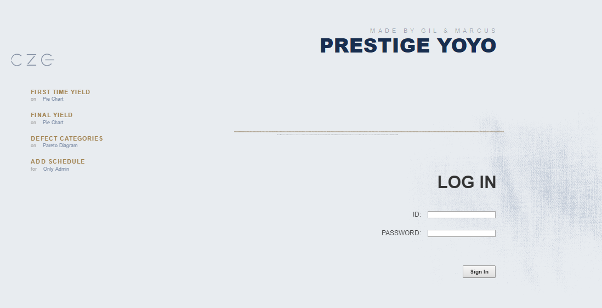
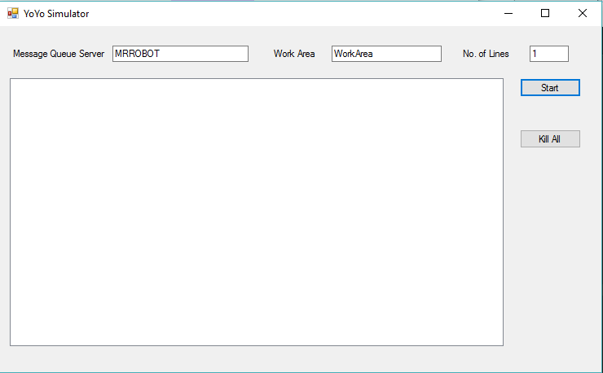
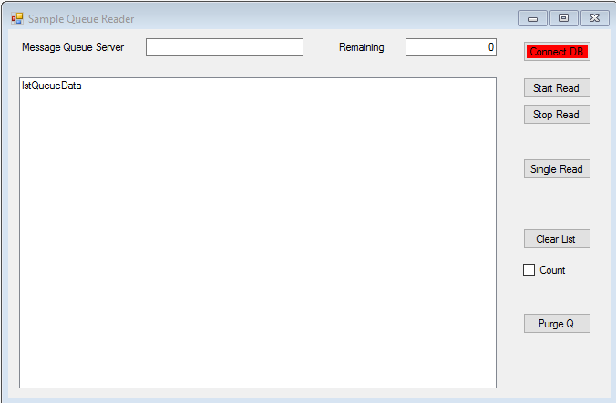

# Prestige YoYo
> This project is to visualize the processed data in web pages.

### Used Technologies

ASP.NET, C#, SQL server, Message Queue, Visual Studio 

## Description

`Message queue reader` read the raw data from message queue, refine raw data, and save to SQL SERVER. `Prestige YoYo(ASP.NET)` is retrieve the refined data from SQL SERVER and visualize the processed data on Pareto Diagram and Pie charts on web pages. Web pages serve the authentication for user and admin.

This project is composed of 3 programs.

* YoYo Simulator
	* This simulator produced the raw data containing the station number, fail/pass, time stamp, etc.

* Sample Queue Reader
	* The reader read the raw data and refine data to save in database. 
	* Depending on message numbers in message queue, transaction size between reader and database is reduced or increased.
	* It contain harness test.

* Prestige YoYo
	* It grab the data from database, process data, and visualize on Pie chart and Pareto diagram.
	* It serves authentication for anonymous, user and admin. anonymous can't access any page(only login). user can access charts. admin can add and update data to database. 

## Screen Shot




## Installation

Windows:

```sh

```

## Usage example


## Development setup

The tables should be created on SQL server before programs run by using `yoyoDB.sql`.
